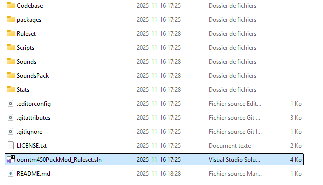
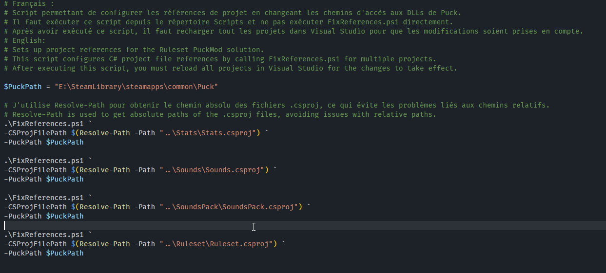
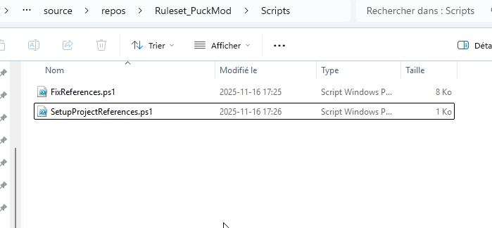
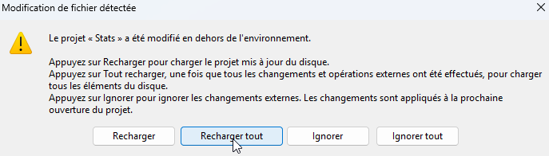
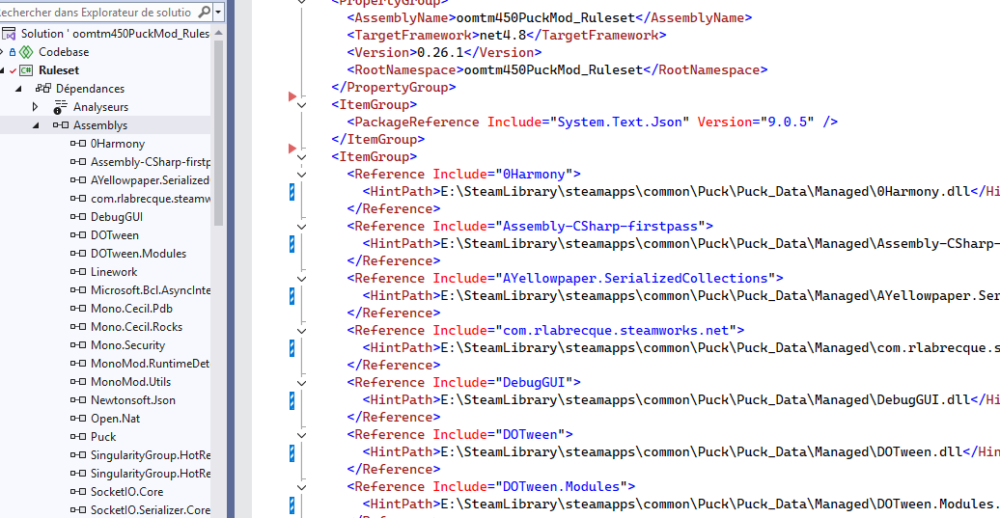

# Ruleset_PuckMod
Ruleset mod for the game Puck.
https://steamcommunity.com/sharedfiles/filedetails/?id=3501446576

# Requirements
- Puck
- Visual Studio (.NET Framework 4.8)

# How to initialize project

## 1. Open solution (.sln file)

## 2. Change the PuckPath variable in the SetupProjectReferences script

## 3. Run the SetupProjectReferences script
The script changes the paths the project uses to find the .dll files that it needs to compile.

## 4. Reload your .csproj files and save all changes
Click on reload all.

## 5. Your assemblies and references should look normal without warnings and you can begin coding.
